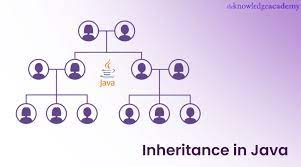

## QA02_NT MENTOR TEAM
## Depo Projesi

### Proje İçeriği:
> - Bir market veya fabrika için uygulanan bir depo uygulamasıdır.
> ### A - Öncelikle ürün tanımlaması yapılmalı. 
> - ID, urunIsmi, uretici, miktar, birim ve raf (6 adet fields mevcut).
> ### B - methodlar oluşturulmalı.
>>  1 - urunTanımlama() ==> 
> - urunun ismi, ureticisi ve birimi girilecek.
> - id otomatik oluşturulmali ve benzersiz olmalı
> - RAF="-" ve Miktar=0 default degerleri girilmeli
>>  2 - urunListele() ==> 
> - Tanimlanan urunler listelenecek. 
> - Urunun adeti ve raf numarasi tanimlama yapilmadiysa default deger gorunsun.
> - yazdirirken printf(%10) kullanilsin.
>>  3 - urunGirisi() ==> 
> - giris yapmak istedigimiz urnune id numarasi ile girecegiz.
>> 4 - urunuRafaKoy() ==> 
> - listeden urunu sececegiz ve id numarasina gore urunu rafa koyacagiz.
>> 5 - urunCikisi() ==> 
> - listeden urunu sececegiz ve urunu cikis yapcagiz. 
> - burada urun listesinden sadece miktarda degisiklik yapilacak.
> - urun adedi 0 dan az olamaz. 0 olunca urun tanimlamasi silinmesin. sadece miktari 0 olsun.
>> 6 - ===> yapilan tum degisiklikler listede de gorunsun.

### Proje Hazirlanirken:
> - **Inheritance** yöntemi kullanılarak method kolla ana methodlar çalıştırılmıştır.
> - **ncop** ile get ve set methodlarini kullanarak datalari guncelleme ve data okumalar yaptik.
> - Yine Methodlar class’ini urunler class’ina **extends** yaparak method kolsuz kullanimi sagladik.

### Kullanılan Methodlar ve içerikleri
> - 1- **menu()** ==> Ana menu ve giris numarasina gore diger methodlara yonlendirebilecek.
> - 2- **urunTanimlama()** ==> Listede olamayan yeni urunlerin eklenmesi
> - 3- **birimsec()** ==> Kullanicidan girilen urun birimini almasi ve listeye eklemesi saglanir.
    Not: birim listeside istege bagli olusturulabilir.
> - 4- **urunListeCagir()** ==> bazi durumlarda sadece listenin cagrilmasini istedigimizde kullaniriz.
> - 5- **menuSor()** ==> ana menuye veya cikisa yonlendiriri
> - 6- **urunListele()** ==> var olan urun listesi console'da gostermek icin.
> - 7- **urunGirisi()** ==> Tanimlanan urunlere miktar ve raf eklenmesi icin.
    eger daha once eklenen bir urun ise sadece miktar eklenir.
> - 8- **idKontrol()** ==> Urun ID otomatik olusturulur ve silinen ID ler dahi saklanir.
    bircok methodda urun ID girisi oldugu icin tek bir method ile ID kontrolu saglamis oluyoruz.
> - 9- **rafaKoy()** ==> Tanimli raf listesini gosterir ve bu raf listesine gore urune raf ismi eklenir.
> - 10- **urunCikisi()** ==> Girisi yapilan urun listesinden miktar cikisi yapilir. Stoktan fazla cikis yapilamaz.
    stokta urun kalmazsa raf listesini de bosaltir. stokta hic urun yoksa da uyari verir.
> - 11- **urunSil()** ==> Tanim listesinden urunu silmek icin kullanilir. Stokta urun varsa silmez ve uyari verir.
> - 12- **silinenUrunler()** ==> Tanim listsesinden silienn urunleri kayit altina alinir ve istendigi zaman listeler.
> - 13- **silinenUrunleriYazdir()** ==> Tanim listsesinden silienn urunleri consol'da yazdirir.
> - 14- **menuCikisi()** ==> porgramdan tamamen cikmak icin.
> - 15- **hazirTanimliUrunler()** ==> Ozellikle test asamasinda surekli urun eklemek yerine mevcut bir liste olusturur.

